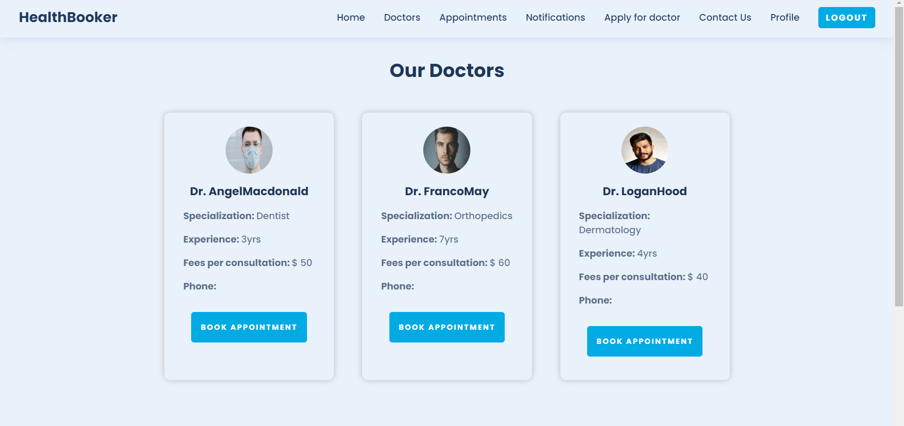
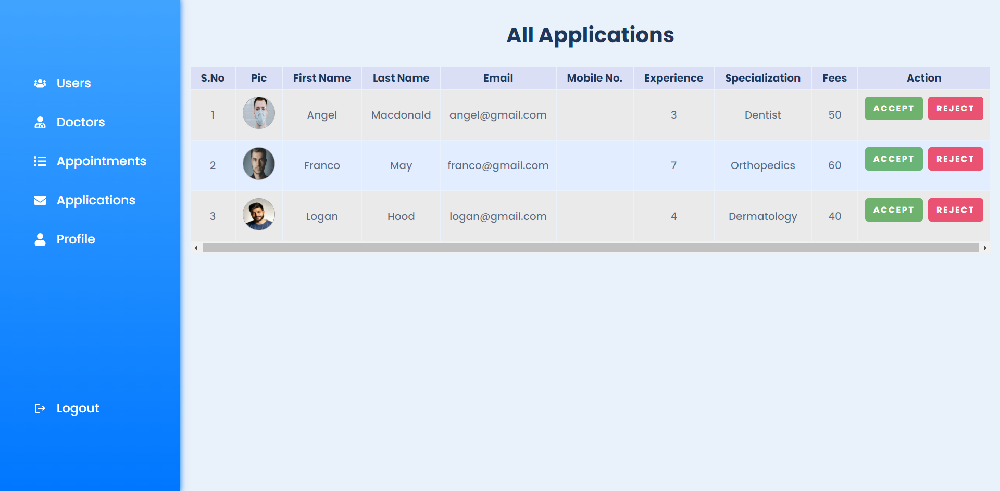

# MentalEase Frontend 🧠💚

A comprehensive mental health consultation platform built with React that connects users with healthcare professionals and provides AI-powered support tools for mental wellness.

## 🌟 About MentalEase

MentalEase is a modern web application designed to make mental health support accessible, convenient, and compassionate. Our platform bridges the gap between individuals seeking mental health assistance and qualified healthcare professionals, while also providing innovative tools like AI chatbots and therapeutic games to support users on their wellness journey.

**Mission**: To provide professional and compassionate mental health consultation services in a safe, accessible digital environment.


### 🎯 Who Is This For?
- **Individuals seeking mental health support** - Easy access to professional consultations
- **Mental health professionals** - Platform to connect with patients and manage appointments  
- **Healthcare administrators** - Tools to oversee and manage the platform
- **Anyone needing immediate support** - 24/7 AI chatbot and therapeutic tools

## ✨ Key Features

### 🩺 **Professional Consultations**
- **Doctor Discovery**: Browse qualified mental health professionals
- **Appointment Booking**: Schedule consultations with ease
- **Profile Management**: Maintain detailed user and doctor profiles
- **Application System**: Streamlined process for doctors to join the platform

### 🤖 **AI-Powered Support**
- **Mental Health Chatbot**: 24/7 AI-powered conversations for immediate support
- **Intelligent Responses**: Contextual mental health guidance and resources
- **Safe Space**: Confidential environment for expressing thoughts and feelings

### 🎮 **Therapeutic Tools**
- **Relaxation Games**: Interactive games designed to reduce stress and anxiety
- **Mindfulness Activities**: Engaging content to promote mental wellness
- **Instant Access**: No login required for basic therapeutic tools

### 👤 **User Experience**
- **Secure Authentication**: JWT-based login and registration system
- **Protected Routes**: Secure access to sensitive healthcare information
- **Responsive Design**: Optimized for desktop, tablet, and mobile devices
- **Real-time Notifications**: Stay updated on appointments and messages

### 👨‍💼 **Administrative Features**
- **User Management**: Comprehensive admin dashboard
- **Doctor Verification**: Review and approve healthcare professional applications
- **Appointment Oversight**: Monitor and manage platform activities
- **Analytics Dashboard**: Insights into platform usage and performance

## 🛠️ Technology Stack

### **Frontend Framework**
- **React 18.2.0** - Modern JavaScript library for building user interfaces
- **React Router DOM 6.8.0** - Declarative routing for React applications
- **Material-UI 5.13.1** - React components implementing Google's Material Design

### **State Management**
- **Redux Toolkit 1.9.1** - Efficient Redux logic and state management
- **React Redux 8.0.5** - Official React bindings for Redux

### **UI/UX Libraries**
- **React Icons 4.7.1** - Popular icon library
- **React Hot Toast 2.4.0** - Beautiful toast notifications
- **React CountUp 6.4.1** - Animated number counters
- **React Spinners 0.13.8** - Loading spinner collection

### **API & Authentication**
- **Axios 1.2.5** - Promise-based HTTP client
- **JWT Decode 3.1.2** - JSON Web Token decoder
- **HTTP Proxy Middleware 2.0.6** - Development proxy configuration

### **Additional Tools**
- **Cloudinary 1.37.0** - Cloud-based image management
- **React Time Picker 5.2.0** - Time selection component

## 📋 Prerequisites

Before running this application, make sure you have the following installed:

- **Node.js** (version 16.0 or higher)
- **npm** (version 8.0 or higher) or **yarn**
- **Git** for version control

## 🚀 Quick Start Guide

### For Users
1. **Visit the Homepage** - Learn about our services and mission
2. **Register/Login** - Create your account or sign in
3. **Browse Doctors** - Find the right mental health professional
4. **Book Appointment** - Schedule your consultation  
5. **Use AI Chatbot** - Get immediate support when needed
6. **Play Therapeutic Games** - Access relaxation tools anytime

### For Mental Health Professionals
1. **Apply to Join** - Submit your credentials through our application system
2. **Await Approval** - Our admin team will review your application
3. **Set Up Profile** - Complete your professional profile
4. **Manage Appointments** - Handle consultations through the dashboard
5. **Connect with Patients** - Provide care through our secure platform

## 🚀 Installation & Setup

### 1. Clone the Repository
```bash
git clone https://github.com/jazil10/MentalEase-Frontend.git
cd MentalEase-Frontend
```

### 2. Install Dependencies
```bash
npm install
# or
yarn install
```

### 3. Environment Configuration
Create a `.env` file in the root directory and configure the following variables:

```env
# API Configuration
REACT_APP_API_BASE_URL=https://mentalease.azurewebsites.net

# Optional: Development settings
REACT_APP_ENVIRONMENT=development
```

### 4. Start the Development Server
```bash
npm start
# or
yarn start
```

The application will open at [http://localhost:3000](http://localhost:3000)

## 📜 Available Scripts

| Command | Description |
|---------|-------------|
| `npm start` | Runs the app in development mode |
| `npm run build` | Builds the app for production |
| `npm test` | Launches the test runner |
| `npm run eject` | **Note: This is a one-way operation** |

## 📁 Project Structure

```
src/
├── components/          # Reusable UI components
│   ├── Navbar.jsx      # Navigation bar
│   ├── Footer.jsx      # Footer component
│   ├── Hero.jsx        # Landing page hero section
│   ├── DoctorCard.jsx  # Doctor profile cards
│   ├── BookAppointment.jsx
│   └── ...
├── pages/              # Main application pages
│   ├── Home.jsx        # Landing page
│   ├── Login.jsx       # User authentication
│   ├── Register.jsx    # User registration
│   ├── Doctors.jsx     # Doctor listings
│   ├── Chatbot.jsx     # AI chat interface
│   ├── Game.jsx        # Therapeutic games
│   ├── Dashboard.jsx   # Admin/User dashboard
│   └── ...
├── redux/              # State management
│   ├── store.js        # Redux store configuration
│   └── reducers/       # Redux reducers
├── middleware/         # Route protection and utilities
├── helper/             # Utility functions
│   ├── apiCall.js      # API communication
│   └── convertImage.js # Image processing
├── styles/             # CSS stylesheets
├── images/             # Static image assets
└── constants.js        # Application constants
```

## 📷 Screenshots

### Doctor Consultation Features

*Browse qualified mental health professionals*

  
*Easy appointment scheduling interface*

### User Dashboard & Profile

*Comprehensive user profile management*


*Track and manage your appointments*

### Administrative Interface  

*User management dashboard*


*Doctor application review system*

## 🌐 Key Pages & Routes

| Route | Component | Access Level | Description |
|-------|-----------|--------------|-------------|
| `/` | Home | Public | Landing page with platform overview |
| `/login` | Login | Public | User authentication |
| `/register` | Register | Public | New user registration |
| `/doctors` | Doctors | Public | Browse available mental health professionals |
| `/game` | Game | Public | Relaxation and therapeutic games |
| `/chatbot` | Chatbot | Protected | AI-powered mental health chat |
| `/appointments` | Appointments | Protected | Manage user appointments |
| `/profile` | Profile | Protected | User profile management |
| `/applyfordoctor` | ApplyDoctor | Protected | Doctor application form |
| `/dashboard/*` | Dashboard | Admin/Protected | Administrative interface |

## 🔧 Development & Deployment

### Development Best Practices
- Use React Hooks for component logic
- Follow Material-UI design principles  
- Implement proper error handling and loading states
- Write descriptive commit messages
- Test components thoroughly before pushing

### Environment Variables
The application supports different environments with the following variables:

```env
# Required - Backend API endpoint
REACT_APP_API_BASE_URL=https://mentalease.azurewebsites.net

# Optional - Environment setting
REACT_APP_ENVIRONMENT=development

# Optional - Feature flags
REACT_APP_ENABLE_CHATBOT=true
REACT_APP_ENABLE_GAMES=true
```

### Building for Production
```bash
npm run build
```
This creates an optimized production build in the `build/` folder.

### Deployment
The application is designed to work with:
- **Netlify** - Static site deployment
- **Vercel** - React application hosting  
- **Azure Static Web Apps** - Microsoft cloud hosting
- **AWS S3** - Static website hosting

## 🧪 Testing

Run the test suite with:
```bash
npm test
```

The project uses React Testing Library for component testing. Tests are located alongside components in `__tests__` folders or with `.test.js` suffixes.

## 🔒 Authentication & Security

- **JWT-based Authentication**: Secure token-based user sessions
- **Protected Routes**: Middleware ensuring authorized access
- **Role-based Access**: Different permissions for users, doctors, and admins
- **Secure API Communication**: All API calls use HTTPS

## 🎨 UI/UX Features

- **Responsive Design**: Mobile-first approach with Material-UI components
- **Loading States**: Smooth loading animations and spinners
- **Toast Notifications**: User-friendly success and error messages
- **Intuitive Navigation**: Clear routing and breadcrumb navigation
- **Accessibility**: WCAG compliant design patterns

## 🤝 Contributing

We welcome contributions to improve MentalEase! Here's how you can help:

### Development Workflow
1. Fork the repository
2. Create a feature branch (`git checkout -b feature/amazing-feature`)
3. Commit your changes (`git commit -m 'Add amazing feature'`)
4. Push to the branch (`git push origin feature/amazing-feature`)
5. Open a Pull Request

### Code Standards
- Follow React best practices and hooks patterns
- Use Material-UI components when possible
- Maintain consistent code formatting
- Write descriptive commit messages
- Include JSDoc comments for complex functions

### Issues & Feature Requests
- Use the GitHub Issues tab to report bugs
- Label issues appropriately (bug, enhancement, question)
- Provide detailed reproduction steps for bugs
- Include mockups or examples for feature requests

## 📞 Support & Contact

If you encounter any issues or have questions:

- **GitHub Issues**: [Create an issue](https://github.com/jazil10/MentalEase-Frontend/issues)
- **Documentation**: Check this README and inline code comments
- **Backend API**: Ensure the backend service is running at the configured endpoint

## 📄 License

This project is licensed under the MIT License. See the `LICENSE` file for details.

## 🙏 Acknowledgments

- **Material-UI Team** for the beautiful component library
- **React Community** for the robust ecosystem
- **Mental Health Professionals** who provided guidance on user experience
- **Open Source Contributors** who made this project possible

---

**Made with ❤️ for mental health and wellness**

*MentalEase - Where technology meets compassionate care*

---

## 📊 Project Stats

- **Version**: 0.1.0
- **React Version**: 18.2.0
- **Build Size**: Optimized for production
- **Browser Support**: Modern browsers (Chrome, Firefox, Safari, Edge)
- **Mobile Responsive**: ✅ Yes
- **PWA Ready**: ✅ Yes (with manifest.json)

## 🔄 Recent Updates

- Initial release with core features
- AI Chatbot integration
- Therapeutic games implementation  
- Admin dashboard functionality
- Mobile responsive design
- Material-UI component integration

For more information, visit our [GitHub repository](https://github.com/jazil10/MentalEase-Frontend).